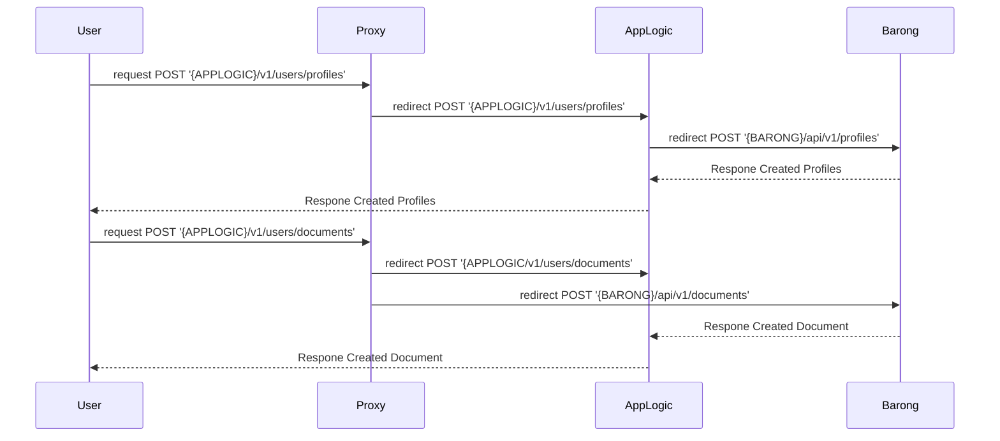

# User Create Document for KYC

```mermaid
sequenceDiagram
    participant User
    participant Proxy
    participant AppLogic
    participant Barong

    User->>Proxy: request POST '{APPLOGIC}/v1/users/profiles'
    Proxy->>AppLogic: redirect POST '{APPLOGIC}/v1/users/profiles'
    AppLogic->>Barong: redirect POST '{BARONG}/api/v1/profiles'

    Barong-->>AppLogic: Respone Created Profiles
    AppLogic-->>User: Respone Created Profiles
    
    User->>Proxy: request POST '{APPLOGIC}/v1/users/documents'
    Proxy->>AppLogic: redirect POST '{APPLOGIC/v1/users/documents'
    Proxy->>Barong: redirect POST '{BARONG}/api/v1/documents'

    Barong-->>AppLogic: Respone Created Document
    AppLogic-->>User: Respone Created Document

```

