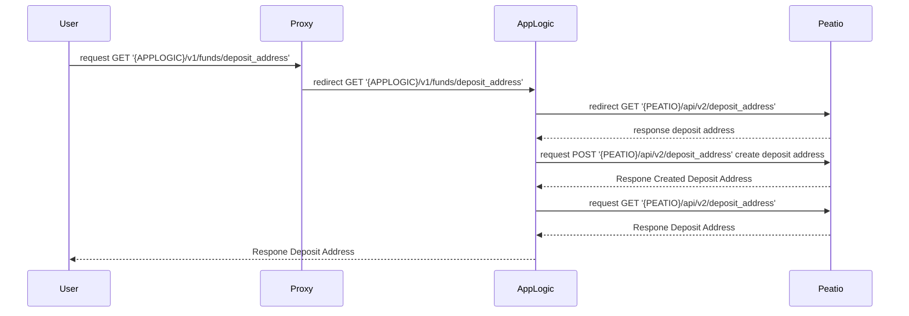

# Deposit

### first getting deposit address 

```mermaid
sequenceDiagram
    participant User
    participant Proxy
    participant AppLogic
    participant Peatio

    User->>Proxy: request GET '{APPLOGIC}/v1/funds/deposit_address'
    Proxy->>AppLogic: redirect GET '{APPLOGIC}/v1/funds/deposit_address'
    AppLogic->>Peatio: redirect GET '{PEATIO}/api/v2/deposit_address'
    Peatio-->>AppLogic: response deposit address
    AppLogic->>Peatio: request POST '{PEATIO}/api/v2/deposit_address' create deposit address
    
    Peatio-->>AppLogic: Respone Created Deposit Address 
    AppLogic->>Peatio: request GET '{PEATIO}/api/v2/deposit_address'
    Peatio-->>AppLogic: Respone Deposit Address 
    AppLogic-->>User: Respone Deposit Address
    
```

